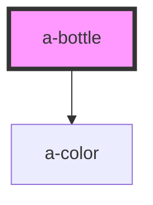

# my-component

<!-- Auto Generated Below -->

## Properties

| Property | Attribute | Description                                | Type     | Default |
| -------- | --------- | ------------------------------------------ | -------- | ------- |
| `colors` | `colors`  | The list of colors represented as an array | `string` | `''`    |

## Dependencies

### Depends on

- [a-color](../color)

### Graph

----------------------------------------------

*Built with [StencilJS](https://stenciljs.com/)*
