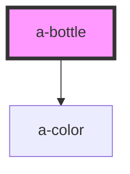

# my-component

<!-- Auto Generated Below -->

## Properties

| Property   | Attribute  | Description                                 | Type      | Default |
| ---------- | ---------- | ------------------------------------------- | --------- | ------- |
| `colors`   | `colors`   | The list of colors represented as an array  | `string`  | `''`    |
| `finished` | `finished` | Indicate a winning state                    | `boolean` | `false` |
| `selected` | `selected` | Indicate that the bottle is selected        | `boolean` | `false` |
| `warning`  | `warning`  | Indicate that the bottle cannot be targeted | `boolean` | `false` |

## Dependencies

### Depends on

- [a-color](../color)

### Graph

----------------------------------------------

*Built with [StencilJS](https://stenciljs.com/)*
