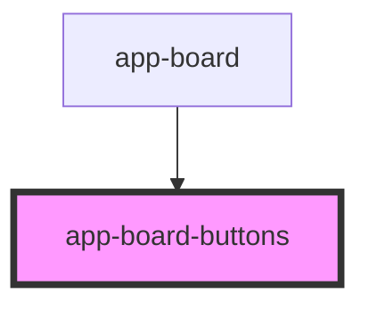

# app-board-buttons

<!-- Auto Generated Below -->

## Properties

| Property            | Attribute            | Description | Type      | Default     |
| ------------------- | -------------------- | ----------- | --------- | ----------- |
| `controlDifficulty` | `control-difficulty` |             | `any`     | `undefined` |
| `controlUndos`      | `control-undos`      |             | `any`     | `undefined` |
| `disableUndo`       | `disable-undo`       |             | `boolean` | `false`     |
| `finished`          | `finished`           |             | `boolean` | `false`     |
| `undos`             | `undos`              |             | `any`     | `undefined` |

## Events

| Event           | Description                                                                                                               | Type               |
| --------------- | ------------------------------------------------------------------------------------------------------------------------- | ------------------ |
| `clickBoardNew` | Emitted when the "New" button is clicked. Behavior is slightly different as consuming board should not use state of menu. | `CustomEvent<any>` |

## Dependencies

### Used by

 - [app-board](../app-board)

### Graph

----------------------------------------------

*Built with [StencilJS](https://stenciljs.com/)*
