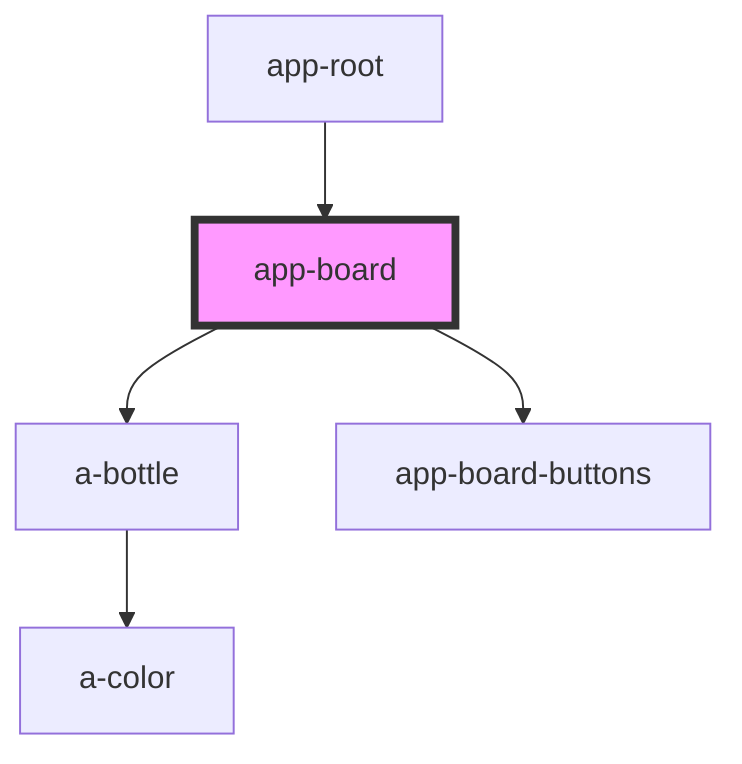

# app-board

<!-- Auto Generated Below -->

## Properties

| Property         | Attribute         | Description | Type     | Default     |
| ---------------- | ----------------- | ----------- | -------- | ----------- |
| `board`          | `board`           |             | `any`    | `undefined` |
| `previousStates` | `previous-states` |             | `any`    | `undefined` |
| `selectedIndex`  | `selected-index`  |             | `number` | `undefined` |
| `undos`          | `undos`           |             | `number` | `undefined` |
| `warningIndex`   | `warning-index`   |             | `number` | `undefined` |

## Dependencies

### Used by

 - [app-root](../app-root)

### Depends on

- a-bottle
- [app-board-buttons](../app-board-buttons)

### Graph

----------------------------------------------

*Built with [StencilJS](https://stenciljs.com/)*
