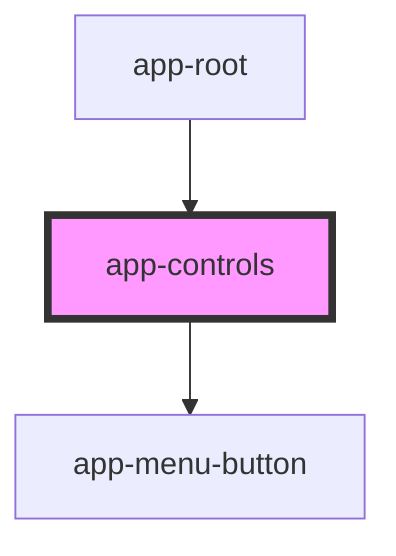

# app-controls

<!-- Auto Generated Below -->

## Properties

| Property     | Attribute | Description | Type                               | Default     |
| ------------ | --------- | ----------- | ---------------------------------- | ----------- |
| `difficulty` | --        |             | `{ start: number; next: number; }` | `undefined` |
| `undos`      | --        |             | `{ start: number; next: number; }` | `undefined` |

## Dependencies

### Used by

 - [app-root](../app-root)

### Depends on

- [app-menu-button](../app-menu-button)

### Graph

----------------------------------------------

*Built with [StencilJS](https://stenciljs.com/)*
