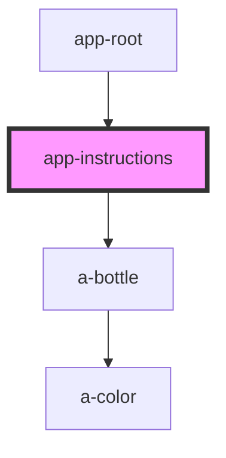

# app-board-buttons

<!-- Auto Generated Below -->

## Dependencies

### Used by

 - [app-root](../app-root)

### Depends on

- a-bottle

### Graph

----------------------------------------------

*Built with [StencilJS](https://stenciljs.com/)*
